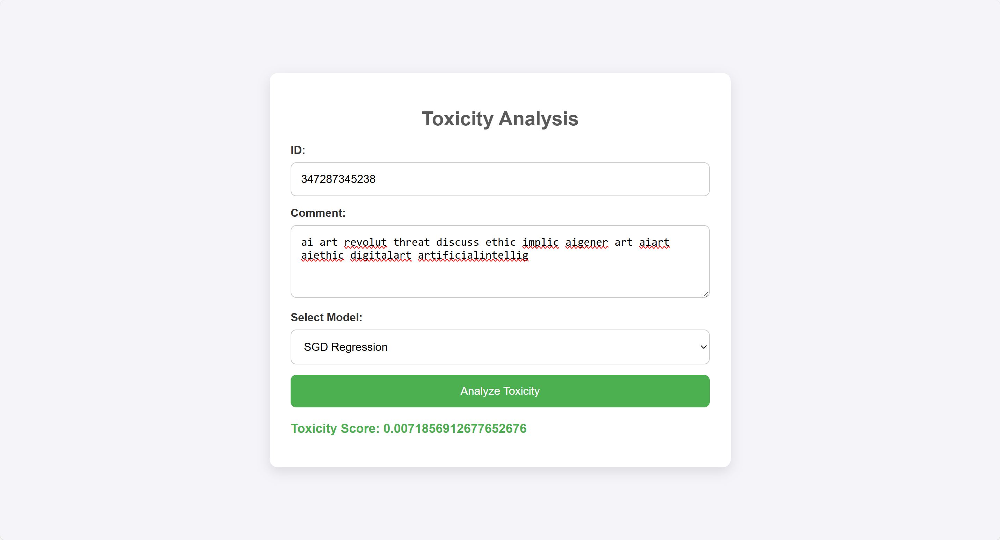

## Data

The data used for training the machine learning models is stored in a Google Drive folder, and is publicly available for reference. The web app and the associated package are based on a fixed training set that has been preprocessed and used for training the models (Decision Tree, SGD Regression, and LSTM). 

This training set contains labeled comments related to AI art discussions, and it serves as the foundation for predicting the toxicity of user-submitted comments. 

For more details on accessing the data, please refer to the appropriate sections in the repository or follow the links to the Google Drive.

[Clik Here](https://drive.google.com/drive/folders/1sf55eVN4-7yXEqG6ucAwWtQQ9Klx7KHt?usp=sharing).

## Web App: Toxicity Analysis

We’ve developed a Flask-based web application to analyze the toxicity of comments, specifically targeting AI art discussions. The app uses pre-trained machine learning models (Decision Tree, SGD Regression, and LSTM) to predict toxicity scores for user-submitted comments. This tool allows for quick, accessible analysis and is designed to make toxicity detection more accessible beyond just AI art.

To use the app, follow the instructions in the [Web App README](./app/README.md).

Here is a demo video showcasing the app in action: [Watch Demo](https://drive.google.com/drive/folders/19lgwRHGh3OYQ3scmR-haQzbSbdO8L0MP?usp=sharing).

Here is a glimpse of the web app interface: 

